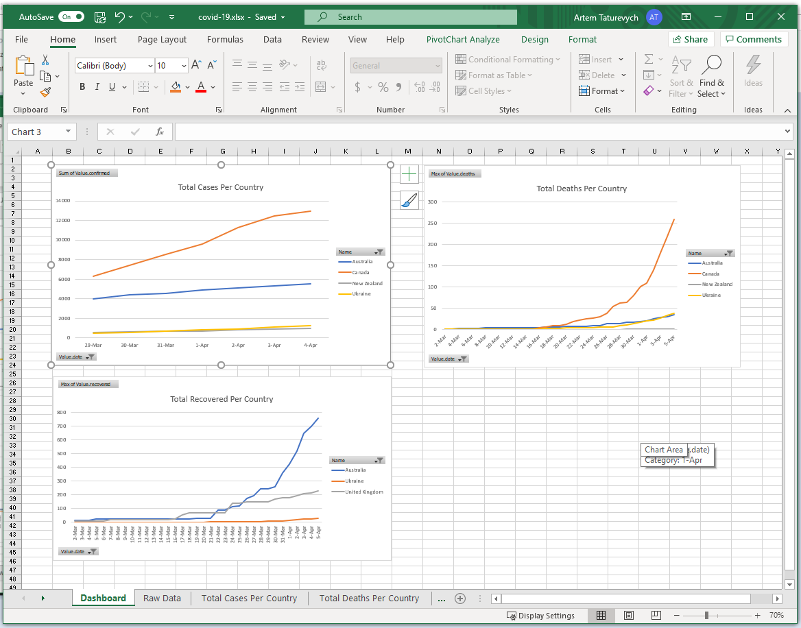

This is interactive COVID-19 dashboard in Excel based on the data provided from [this repository](https://github.com/pomber/covid19)

Visit [this link](https://blog.xarial.com/covid19-dashboard/#covid-19-excel-dashboard) for the instructions of how to use this dashboard.

TODO List:

* Add graphs to represent the statistics per population
* Add graph to represent new cases growths per day per country